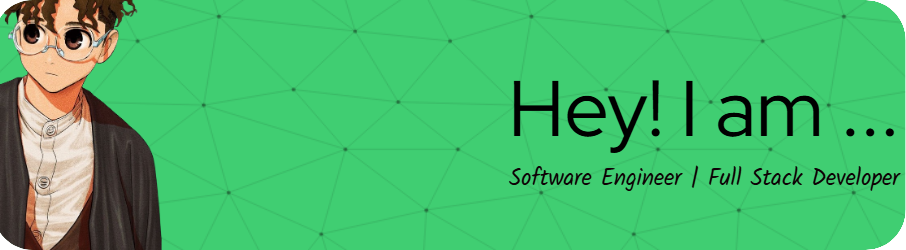

<!-- Usa HTML para ajustar el ancho de la imagen -->

# Hello, I'm Crescens 

Hello! I am a Software Engineer specializing in Backend Development. I am passionate about science, especially astronomy. I enjoy coding with a good cup of coffee and pleasant music in the background. I am always excited to learn and explore new technologies!

## 🌟 Technologies and Tools

  
  ### Programming languages (& HTML)

  </img>
  
  </img>
  
  </img>
  
  </img>
    
  </img>
    
  </img>
    
  </img>
    
  </img>
      
  </img>

### Frameworks & Libraries

  </img>
  
  </img>
  
  </img>
  
  </img>
  
  </img>
  
  </img>
  
  </img>
  
  </img>
  
  </img>
  
  </img>
  
  </img>
   
  
   
  
  

### Software & organization

  </img>
  
  </img>
  
  </img>
  
  </img>
  
  </img>
  
  </img>
  
  </img>
  
  </img>
  
  </img>
  
  </img>
  
  </img>
  
  </img>
  
  </img>
  
  </img>
  
  </img>
  
  </img>
   
  
   
  

### Cloud Services

  </img>
  
  </img>
  
  </img>
  
  </img>

## 📊 GitHub Stats

  
  

## 📫 How to Reach Me
<a target="_blank" href="#"></img></a>	
<a target="_blank" href="https://www.linkedin.com/in/crescens-henry/"></img></a>
<a target="_blank" href="crescencio.ps.code@gmail.com"></img></a>
<a target="_blank" href="#"></img></a>

## 🎓 Education

### Software Engineer

**Polytechnic University of Chiapas**  
Graduation Date: 2024  

[More information about Polytechnic University of Chiapas](https://www.upchiapas.edu.mx/oferta_educativa/Ingenieria_en_Software)

## 🌐 Languages

- Spanish
- English

---

Thank you for visiting my profile! Feel free to contact me if you have any questions or if you want to collaborate on a project.

